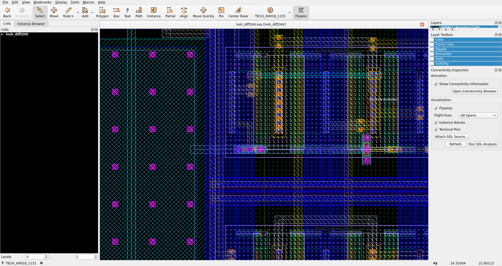
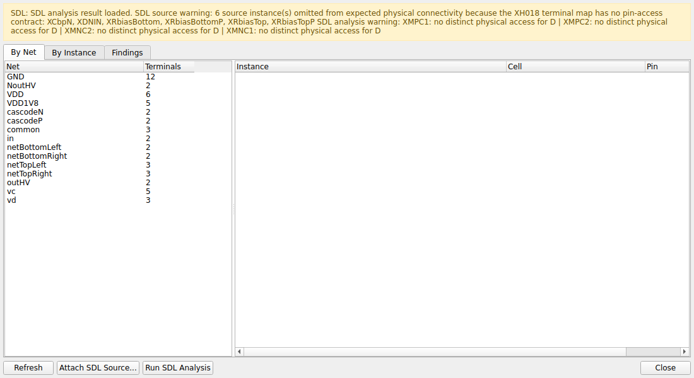
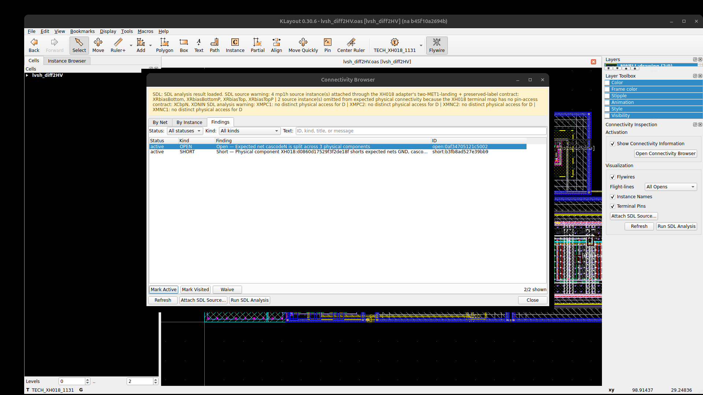

# IIC SDL Connectivity Inspection

KLayout Connectivity Browser, CAS findings and OPEN-only flight-lines for the
open-source IHP SG13G2 flow. This maintained branch intentionally supports only
IHP SG13G2.

The project is a focused fork of Martin Jan Köhler's
[ConnectivityInspectionPlugin](https://github.com/martinjankoehler/ConnectivityInspectionPlugin).
Its expected-connectivity input is produced by the companion
[IIC SDL Netlist Import](https://github.com/mwolodzk/klayout-netlist-import)
package. The upstream projects remain the source of the original plugin idea
and reusable KLayout utilities.

## What it provides

- `By Net`, `By Instance`, and filterable `Findings` tabs;
- `OPEN`, `SHORT`, `WRONG_NET`, binding and parameter diagnostics;
- flight-lines only between disconnected physical components of one expected
  net, using an MST with `k-1` lines for `k` components;
- marker emphasis, multi-selection, zoom, highlight and cross-probing;
- stale-result detection when layout or source changes;
- read-only SG13G2 analysis: geometry is read from the saved OAS/GDS and never
  written by the analyzer.

## Installation

Install these Salt.Mine dependencies in the IHP KLayout profile:

1. `KLayoutPluginUtils` 0.28 or newer;
2. `IICSDLNetlistImportPlugin` 0.15 or newer;
3. `IICSDLConnectivityInspectionPlugin` 0.5.

Restart KLayout. The panel and commands appear under
`Tools → Connectivity Inspection`.

## IHP SG13G2 workflow

1. Start KLayout with `iic-ihp klayout -e` and open or create the target layout.
2. Use `File → Import → Netlist` to select the SPICE/CDL source.
3. Choose the matching IHP device mappings, validate node order, and import.
4. Save the layout. Import writes `<layout>.sdl.json` beside it.
5. Click `Run SDL Analysis` in the Connectivity Inspection panel. The batch
   adapter reads the saved layout and writes diagnostic sidecars only.
6. Open `Connectivity Browser`, inspect `Findings`, and select entries to zoom
   and emphasize the corresponding markers.
7. Use `All Opens` to display only real missing connections. Fix and save the
   routing, then run the analysis again; resolved flight-lines disappear.

For an existing SG13G2 layout, import into a reviewed working copy if bindings
are absent. Netlist Import creates expected connectivity and instance metadata;
the analyzer itself is read-only but cannot infer a missing source binding.

## Screenshots

The retained screenshots illustrate the Connectivity Browser and marker UI.
They are binary evidence assets and are not package configuration or runtime
inputs.







## Tests

Run the non-GUI suite from the repository root:

```bash
python3 -m pytest -q
```

The package manual is available at
`Tools → Connectivity Inspection → SDL / CAS User Manual...`.

## Authorship and validation

The SDL/CAS fork was implemented by OpenAI Codex, model `gpt-5.6-sol`, with
high reasoning effort, under Michał Wołodźko's direction. The implementation
was visually checked in KLayout during development, and Michał Wołodźko also
verified the pilot behavior. The current IHP-only release is additionally
validated by non-GUI tests and clean package scans.

License: GPL-3.0-or-later.
